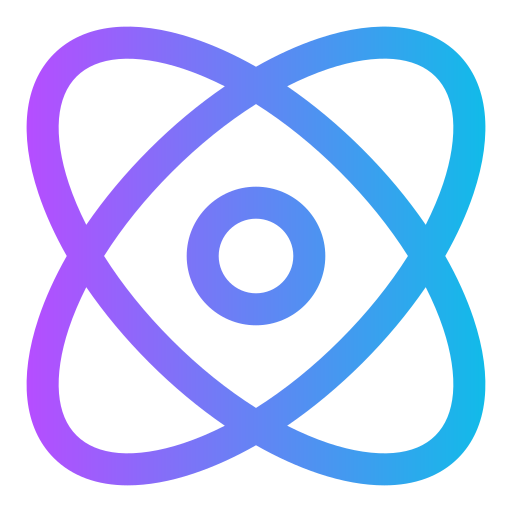
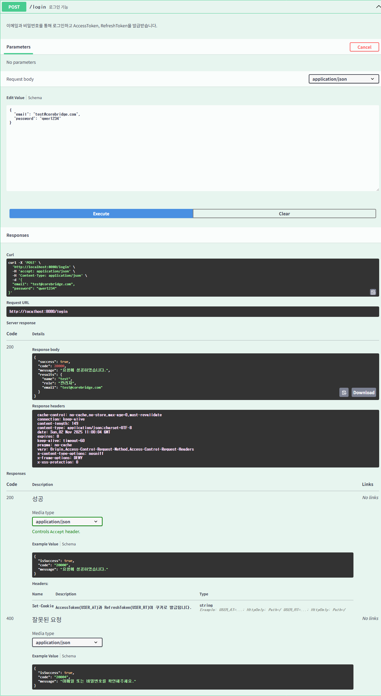
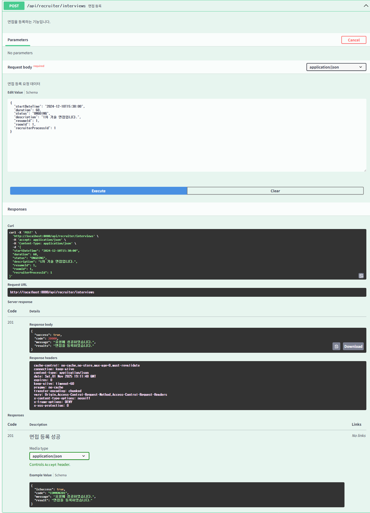
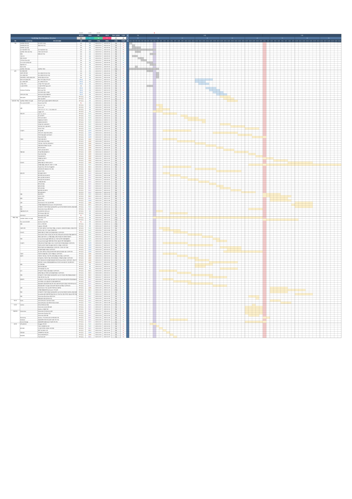

<h1 align="center">
    
    CoreBridge
</h1>

  

<h3 align="center">3팀 - Halo</h3>

  

# 👨‍💻 팀원 구성

<table>
  <tr>
    <td>
      
    </td>
    <td>
      
    </td>
    <td>
      
    </td>
    <td>
      
    </td>
    <td>
      
    </td>
  </tr>
  <tr>
    <td align="center">
      <a href="https://github.com/lesw1216">이상우</a>
    </td>
    <td align="center">
      <a href="https://github.com/atimaby28">양승우</a>
    </td>
    <td align="center">
      <a href="https://github.com/Hanryang-Kim">김륜환</a>
    </td>
    <td align="center">
      <a href="https://github.com/junsun-yeam">염준선</a>
    </td>
    <td align="center">
      <a href="https://github.com/young1042">김영재</a>
    </td>
  </tr>
</table>

  

---

# 실제 배포 접속 주소

## 프론트 

* [www.core-bridge.co.kr](https://www.core-bridge.co.kr/jobs)

## 백엔드

* [api.core-bridge.co.kr](https://api.core-bridge.co.kr)

## URL 정리

* `https://www.core-bridge.co.kr/jobs~` : 모든 권한의 사용자
* `https://www.core-bridge.co.kr/amdin/~` : 관리자, 채용 담당자, 면접관

# 테스트 계정

## 관리자

* ID : `admin01@core-bridge.co.kr`
* PW : `qwer1234`

## 채용 담당자

* ID : `recruiter01@core-bridge.co.kr`
* PW : `qwer1234`

## 면접관

* ID : `interviewer01@core-bridge.co.kr`
* PW : `qwer1234`

## 지원자

* ID : `lesw1216@gmail.com`
* PW : `qwer1234`

---

# Front-End

[프론트엔드 깃허브 바로가기](https://github.com/beyond-sw-camp/be17-fin-Halo-CoreBridge-FE)

# Swagger

* [Swagger 바로가기](https://api.core-bridge.co.kr/swagger-ui/index.html)
* [Swagger PDF 바로가기](docs/swagger/Swagger.pdf)

# 핵심 기능 테스트

[핵심 기능 테스트 문서로 보기](https://github.com/beyond-sw-camp/be17-fin-Halo-CoreBridge-BE/wiki/2%E2%80%902.-%EB%8B%A8%EC%9C%84-%ED%85%8C%EC%8A%A4%ED%8A%B8-%EA%B2%B0%EA%B3%BC%EC%84%9C)

 로그인 

채용 공고 프로세스 

* 특정 채용 공고의 채용 단계 목록 조회

* 특정 채용 공고의 채용 단계 순서 변경

* 특정 채용 공고에 채용 단계를 추가

.png)

* 특정 채용 단계 수정 

* 채용 단계 삭제

 사내 공지 사항 

* 특정 게시글 조회

* 게시글 삭제

* 게시글 수정

 채용 공고 

* 채용 공고 전체 목록 조회

* 채용 공고 상세 조회

* 채용 공고 헤더 부분 기본 정보 조회

* 채용 공고 수정

 공통 채용 공고 

* 공통 채용 공고

 채용 공고 스케쥴 

* 채용 공고 스케줄 목록 조회

* 채용 공고 스케쥴 공유

* 채용 공고 스케쥴 상세 조회

* 채용 공고 스케쥴 생성

* 채용 공고 스케쥴 일괄 공유

* 채용 공고 스케쥴 수정

* 채용 공고 캘린더 조회

 인증 

* 인증 코드 전송

* 인증 코드 검증

 단계별 지원자 관리 

* 지원자 채용 단계 변경

* 특정 채용 공고의 단계별 지원자 목록 조회

 회원 관리 

* 로그 아웃

* 이력서 회원 정보 조회

* 회원 가입

* 회원 정보 조회

 회원 정보 찾기 

* 비밀 번호 재설정

* 비밀번호 찾기 링크 전송

* 이메일 찾기

 이력서 

* 이력서 목록 생성

* 이력서 목록 조회

* 이력서 삭제

* 이력서 수정

* 이력서 조회

* 자기소개서 항목 답변 목록 조회

* 자기소개서 항목 답변 생성

 면접 

* 면접 등록

 부서 

* 부서 조회

# CI / CD 계획서 & 통합 테스트 결과서

[CI / CD 계획서 & 통합 테스트 결과서 바로가기](https://github.com/beyond-sw-camp/be17-fin-Halo-CoreBridge-BE/wiki/4.-%EC%8B%9C%EC%8A%A4%ED%85%9C-%ED%86%B5%ED%95%A9)

---

# 📑 목차 (Table of Contents)

- [프로젝트 기획과 설계](#프로젝트-기획과-설계)
  + [1. 시스템 아키텍처](#-1-시스템-아키텍처)
  + [2. ERD](#-2-erd)
  + [3. 프로젝트 기획서](#-3-프로젝트-기획서)
  + [4. 요구사항 명세서](#-4-요구사항-명세서)
  + [5. WBS](#-5-wbs)

- [프로젝트 소개](#-프로젝트-소개)
    * [1. 개요](#1-개요)
    * [2. 현황 및 목표](#2-현황-및-목표)
    * [3. 핵심 기능](#3-핵심-기능)
        + [1. 실시간 지원자 상태 관리](#-1-실시간-지원자-상태-관리)
        + [2. 지원자 채용 단계 자동화 처리](#-2-지원자-채용-단계-자동화-처리)
        + [3. 면접 일정 관리 및 충돌 방지](#-3-면접-일정-관리-및-충돌-방지)
        + [4. 대면 면접 시 실시간 평가 공유](#-4-대면-면접-시-실시간-평가-공유)
        + [5. 유연한 채용 프로세스 체인](#-5-유연한-채용-프로세스-체인)
        + [6. 실시간 채용 단계 대시보드 & 파이프라인 시각화](#-6-실시간-채용-단계-대시보드--파이프라인-시각화)
        + [7. 실시간 화상 면접](#-7-실시간-화상-면접)
        + [8. 데이터 통계 및 분석 대시보드](#-8-데이터-통계-및-분석-대시보드)
        + [9. 대규모 트래픽 대응 대기열 시스템](#-9-대규모-트래픽-대응-대기열-시스템)

---

# 프로젝트 기획과 설계

## 🔧 1. 시스템 아키텍처

## 🔗 2. ERD

## 📑 3. 프로젝트 기획서

[프로젝트기획서 바로가기](./docs/프로젝트기획서.pdf)

## ✅ 4. 요구사항 명세서

[요구사항명세서 바로가기](./docs/요구사항명세서.pdf)

요구사항 명세서 상세보기

## 📅 5. WBS

[일정 관리를 위한 WBS 바로가기](./docs/WBS.pdf)

WBS 상세보기

# 📋 프로젝트 소개

## 1. 개요

> ## ❝ 지원부터 결과 발표까지, 채용의 모든 여정을 하나의 순간으로 만듭니다. ❞ 
>
> CoreBridge는 실시간 파이프라인 기술로 채용 과정을 매끄럽게 연결하는 차세대 채용 관리 플랫폼입니다.
> 
> 복잡한 절차는 단순하게, 느린 소통은 즉각적으로.
채용의 경험을 기술로 재해석합니다.

오늘날 채용 시장은 **속도가 곧 경쟁력인 시대**입니다. 특히 IT 및 스타트업 업계에서는 **총알 채용**이 새로운 표준으로 자리 잡으며, 기업들은 지원자들이 다른 제안을 받기 전에 **단기간 내 채용을 완료**하려는 흐름이 강해지고 있습니다.

그러나 많은 스타트업과 중소기업들은 여전히 **스프레드시트, 메신저, 이메일 등 수동적인 방식**으로 지원자 상태를 관리하고 있어 **지원자의 현재 채용단계를 실시간**으로 확인 할 수 없고, **정보 불일치, 일정 충돌, 지연된 의사 결정** 같은 문제가 끊임없이 발생합니다. 또한 대기업용 ERP나 ATS 시스템은 무겁고 복잡하여, 소규모 HR팀에게는 도입 비용과 유지보수 부담이 큰 실정입니다.

따라서 이제 시장은 **빠르고 직관적이며, 가볍게 도입 가능한 실시간 채용 관리 솔루션**을 요구하고 있습니다.

본 프로젝트는 이러한 요구에 응답하여 지원부터 채용 마감까지 지원자의 채용 전 과정을 **실시간 파이프라인**으로 자동화하여 HR 담당자의 업무 효율을 높이고, **차별화된 채용 경험을 제공하는 시스템 구축**을 목표로 합니다.

---

## 2. 현황 및 목표

### 📌 현황

* **채용 시장의 과열**: 채용 시장의 경쟁이 과열되면서, 한정된 인력으로 효율적인 채용을 진행하는 것이 점점 더 어려워지고 있습니다.
* **비효율적인 채용 프로세스** : 수동적이고 분산된 채용 관리로 인해 정보 불일치와 일정 지연 반복되고 있습니다.
* **실시간 채용 관리 솔루션의 부재** : 지원부터 면접, 결과 발표까지의 과정이 자동화되지 않아 실시간 관리가 어렵습니다.

### 🎯 목표

* **실시간 채용 파이프라인 구현**: 지원자의 모든 상태 변화를 실시간으로 반영해 신속한 의사결정을 지원합니다.
* **업무 효율 극대화**: 분산된 채용 정보를 통합 관리하여 HR 담당자의 반복 업무를 최소화합니다.
* **협업 중심 환경 구축**: 팀원 간 실시간 정보 공유로 일정 충돌과 커뮤니케이션 오류를 방지합니다.
* **데이터 가시성 확보**: 대시보드를 통해 단계별 진행 현황과 병목 구간을 한눈에 파악합니다.

---

## 3. 핵심 기능

### 🚀 1. 실시간 지원자 상태 관리

* **Kafka**와 **Redis** 기반의 이벤트 드리븐 구조로, 지원자 상태(서류 통과·면접 확정·합격 등)를 실시간 반영하고 팀 전체에 즉시 동기화합니다.
* 모든 상태 변경은 지연 없이 반영되어 HR 담당자와 면접관이 **동일한 최신 정보를 공유**할 수 있습니다.

### 🚀 2. 지원자 채용 단계 자동화 처리

* 지원자가 각 채용 단계(서류 -> 면접 -> 최종 평가)를 통과하면 **자동으로 다음 단계로 이동**하며, 관련 담당자와 지원자에게 **즉시 알림이 전송**됩니다.
* 최종 평가 결과에 따라 **합격·불합격이 자동 확정**되고, 발표일에 자동 안내 메일이 발송되는 **완전 자동화 채용 프로세스**를 제공합니다.

### 🚀 3. 면접 일정 관리 및 충돌 방지

* **캘린더 / 타임라인 뷰**를 통해 면접 일정을 시각화하여 공유할 수 있습니다.
* 지원자의 기술 스택에 따라 **적합한 면접관을 자동 배치**하여 효율적인 면접 일정을 구성합니다.
* 면접관 및 지원자 간 **중복 예약이나 일정 충돌을 자동 감지·차단**해 불필요한 혼선을 줄입니다.

### 🚀 4. 대면 면접 시 실시간 평가 공유

* 대면 면접 시 다수의 면접관이 **실시간으로 평가 내용을 공유**할 수 있는 채팅 및 평가 인터페이스를 제공합니다.
* 면접 종료 후 각 면접관의 평가가 **자동으로 취합·정리**되어 공정하고 효율적인 평가 프로세스를 지원합니다.

### 🚀 5. 유연한 채용 프로세스 체인

* 각 채용 공고의 특성과 요구 역량에 따라 **맞춤형 채용 프로세스 체인**을 생성할 수 있습니다.
* 공고별로 단계 구성을 유연하게 조정하여 **조직 규모나 직무별 채용 방식에 최적화된 흐름**을 제공합니다.

### 🚀 6. 실시간 채용 단계 대시보드 & 파이프라인 시각화

* 지원자의 진행 현황, 단계별 병목 구간, 전체 채용 상태를 **칸반형 대시보드에서 실시간으로 시각화**합니다.
* 직관적인 인터페이스를 통해 **팀 전체가 채용 상황을 한눈에 파악하고 빠르게 대응**할 수 있습니다.

### 🚀 7. 실시간 화상 면접

* **WebRTC 기반 화상 면접 기능**을 제공하여 시간과 장소의 제약 없이 면접을 진행할 수 있습니다.
* 빠른 채용과 효율적인 의사소통이 필요한 기업 환경에 적합한 **실시간 면접 경험**을 제공합니다.

### 🚀 8. 데이터 통계 및 분석 대시보드

* 지원자 현황, 단계별 전환율, 공고별 경쟁률 등 **다양한 채용 지표를 시각화**하여 제공합니다.
* 이를 통해 **채용 효율성 진단과 전략적 의사결정**이 가능합니다.

### 🚀 9. 대규모 트래픽 대응 대기열 시스템

* 채용 공고 등록이나 면접 일정 요청이 폭주할 경우, **Redis 기반 대기열 시스템**을 통해 요청을 순차적으로 처리합니다.
* **트래픽 급증 상황에서도 서버 부하를 완화**하고, 안정적인 실시간 응답을 보장합니다.
* **Kafka**와 연동되어 처리 완료 이벤트를 비동기로 발행함으로써 **안정성과 실시간성을 동시에 확보**합니다.

---
