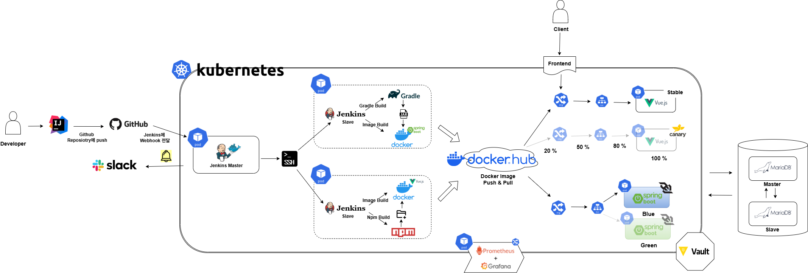

<h1 align="center">
    
    CoreBridge
</h1>

  

<h3 align="center">3팀 - Halo</h3>

  

# 👨‍💻 팀원 구성

<table>
  <tr>
    <td>
      
    </td>
    <td>
      
    </td>
    <td>
      
    </td>
    <td>
      
    </td>
    <td>
      
    </td>
  </tr>
  <tr>
    <td align="center">
      <a href="https://github.com/lesw1216">이상우</a>
    </td>
    <td align="center">
      <a href="https://github.com/atimaby28">양승우</a>
    </td>
    <td align="center">
      <a href="https://github.com/Hanryang-Kim">김륜환</a>
    </td>
    <td align="center">
      <a href="https://github.com/junsun-yeam">염준선</a>
    </td>
    <td align="center">
      <a href="https://github.com/young1042">김영재</a>
    </td>
  </tr>
</table>

  

---

# 실제 배포 접속 주소

## 프론트 

* [www.core-bridge.co.kr](https://www.core-bridge.co.kr/jobs)

## 백엔드

* [api.core-bridge.co.kr](https://api.core-bridge.co.kr)

## URL 정리

* `https://www.core-bridge.co.kr/jobs~` : 모든 권한의 사용자
* `https://www.core-bridge.co.kr/amdin/~` : 관리자, 채용 담당자, 면접관

# 테스트 계정

## 관리자

* ID : `admin01@core-bridge.co.kr`
* PW : `qwer1234`

## 채용 담당자

* ID : `recruiter01@core-bridge.co.kr`
* PW : `qwer1234`

## 면접관

* ID : `interviewer01@core-bridge.co.kr`
* PW : `qwer1234`

## 지원자

* ID : `lesw1216@gmail.com`
* PW : `qwer1234`

---

# Front-End

[프론트엔드 깃허브 바로가기](https://github.com/beyond-sw-camp/be17-fin-Halo-CoreBridge-FE)

# Swagger

* [Swagger 바로가기](https://api.core-bridge.co.kr/swagger-ui/index.html)
* [Swagger PDF 바로가기](docs/swagger/Swagger.pdf)

# 핵심 기능 테스트

[핵심 기능 테스트 문서로 보기](https://github.com/beyond-sw-camp/be17-fin-Halo-CoreBridge-BE/wiki/2%E2%80%902.-%EB%8B%A8%EC%9C%84-%ED%85%8C%EC%8A%A4%ED%8A%B8-%EA%B2%B0%EA%B3%BC%EC%84%9C)

 로그인 

채용 공고 프로세스 

* 특정 채용 공고의 채용 단계 목록 조회

* 특정 채용 공고의 채용 단계 순서 변경

* 특정 채용 공고에 채용 단계를 추가

.png)

* 특정 채용 단계 수정 

* 채용 단계 삭제

 사내 공지 사항 

* 특정 게시글 조회

* 게시글 삭제

* 게시글 수정

 채용 공고 

* 채용 공고 전체 목록 조회

* 채용 공고 상세 조회

* 채용 공고 헤더 부분 기본 정보 조회

* 채용 공고 수정

 공통 채용 공고 

* 공통 채용 공고

 채용 공고 스케쥴 

* 채용 공고 스케줄 목록 조회

* 채용 공고 스케쥴 공유

* 채용 공고 스케쥴 상세 조회

* 채용 공고 스케쥴 생성

* 채용 공고 스케쥴 일괄 공유

* 채용 공고 스케쥴 수정

* 채용 공고 캘린더 조회

 인증 

* 인증 코드 전송

* 인증 코드 검증

 단계별 지원자 관리 

* 지원자 채용 단계 변경

* 특정 채용 공고의 단계별 지원자 목록 조회

 회원 관리 

* 로그 아웃

* 이력서 회원 정보 조회

* 회원 가입

* 회원 정보 조회

 회원 정보 찾기 

* 비밀 번호 재설정

* 비밀번호 찾기 링크 전송

* 이메일 찾기

 이력서 

* 이력서 목록 생성

* 이력서 목록 조회

* 이력서 삭제

* 이력서 수정

* 이력서 조회

* 자기소개서 항목 답변 목록 조회

* 자기소개서 항목 답변 생성

 면접 

* 면접 등록

 부서 

* 부서 조회

# CI / CD 계획서 & 통합 테스트 결과서

[CI / CD 계획서 & 통합 테스트 결과서 바로가기](https://github.com/beyond-sw-camp/be17-fin-Halo-CoreBridge-BE/wiki/4.-%EC%8B%9C%EC%8A%A4%ED%85%9C-%ED%86%B5%ED%95%A9)

---

# 📑 목차 (Table of Contents)

- [프로젝트 기획과 설계](#프로젝트-기획과-설계)
  + [1. 시스템 아키텍처](#-1-시스템-아키텍처)
  + [2. ERD](#-2-erd)
  + [3. 프로젝트 기획서](#-3-프로젝트-기획서)
  + [4. 요구사항 명세서](#-4-요구사항-명세서)
  + [5. WBS](#-5-wbs)

- [프로젝트 소개](#-프로젝트-소개)
    * [1. 개요](#1-개요)
    * [2. 핵심 기능](#2-핵심-기능)
        + [1. 면접 일정 관리](#1-면접-일정-관리)
        + [2. 대면 면접 시 이력서와 평가지 제공](#2-대면-면접-시-이력서와-평가지-제공)
        + [3. 유연한 채용 프로세스 체인](#3-유연한-채용-프로세스-체인)
        + [4. 채용 단계 대시보드 & 파이프라인 시각화](#4-채용-단계-대시보드--파이프라인-시각화)
        + [5. 채용 공고 별 지원자 현황 통계](#5-채용-공고-별-지원자-현황-통계)
        + [6. 검색 엔진 확장](#6-검색엔진-확장)

---

# 프로젝트 기획과 설계

## 🔧 1. 시스템 아키텍처

## 🔗 2. ERD

## 📑 3. 프로젝트 기획서

[프로젝트기획서 바로가기](./docs/프로젝트기획서.pdf)

## ✅ 4. 요구사항 명세서

[요구사항명세서 바로가기](./docs/요구사항명세서.pdf)

요구사항 명세서 상세보기

## 📅 5. WBS

[일정 관리를 위한 WBS 바로가기](./docs/WBS.pdf)

WBS 상세보기

# 📋 프로젝트 소개

## 1. 개요

오늘날 스타트업부터 중견·대기업에 이르기까지, 채용 프로세스는 빠르고 신뢰성 있게 관리하는 것이 필수 요소가 되었습니다.
그러나 많은 기업은 여전히 스프레드시트, 이메일, 메신저, 실제 서류로 지원자 상태를 관리하고 있어, 실시간 확인의 어려움, 정보 불일치, 일정 충돌 등의 문제가 반복되고 있습니다.

대기업은 자체 ATS 시스템을 구축하거나 고가의 솔루션을 사용하지만,
중소·중견기업은 도입 비용, 운영 부담, 복잡한 기능 때문에 어려움을 겪는 경우가 많습니다.

이에 CoreBridge는 가볍고 핵심 기능 중심으로 구성된 채용 플랫폼을 개발했습니다.
필요한 기능을 빠르게 도입할 수 있도록 하고, 기업의 성장에 따라 맞춤형으로 확장 가능한 구조를 핵심 가치로 삼고 있습니다.

---

## 2. 핵심 기능

### 1. 면접 일정 관리

* 캘린더 기반 UI를 제공하며, 팀 전체가 면접 일정을 시각적으로 공유할 수 있습니다.

### 2. 대면 면접 시 이력서와 평가지 제공

* 면접관 여러 명이 동시에 평가할 수 있는 평가지·이력서 뷰어를 제공합니다.

### 3. 유연한 채용 프로세스 체인

* 공고별로 단계(서류 → 1차 → 2차 → 과제 등) 를 자유롭게 구성할 수 있습니다.
* 조직 특성, 직무 요구사항에 따라 맞춤형 프로세스를 생성할 수 있습니다.

### 4. 채용 단계 대시보드 & 파이프라인 시각화

* 지원자가 어떤 단계에 있는지 칸반 형태로 시각화하여 전체 흐름을 쉽게 파악할 수 있습니다.

### 5. 채용 공고 별 지원자 현황 통계

* 공고 기준으로 지원자 목록과 진행 상태를 조회할 수 있습니다.

### 6. 검색엔진 확장

* 초기에는 SQL 기반 검색 엔진을 제공하여 빠른 기능을 제공합니다.
* 기업 규모 증가, 대량의 공고, 지원자 데이터 발생 시 고객사의 요청이 발생하면 Elasticsearch 기반 검색 엔진으로 전환이 가능하도록 설계되어 유연한 검색 성능 확장이 가능합니다.
---
